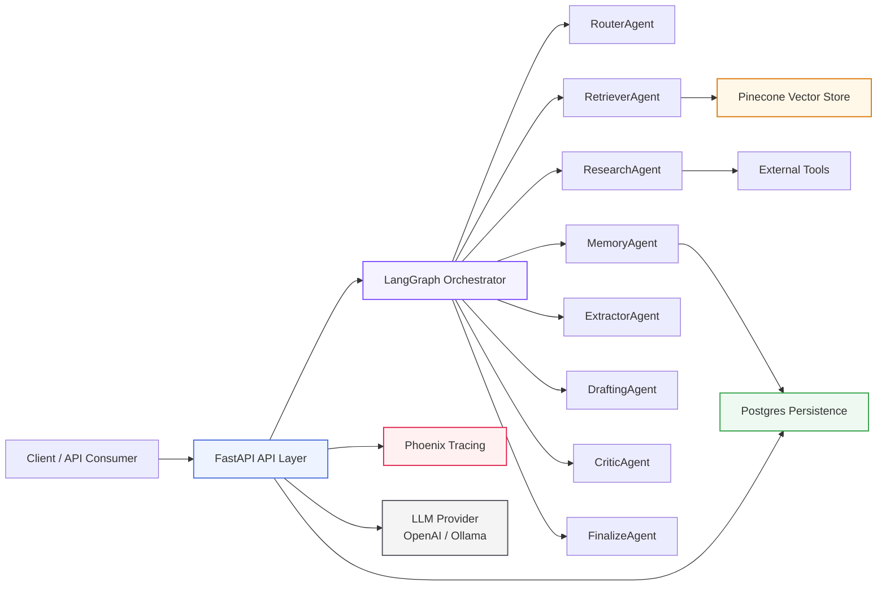
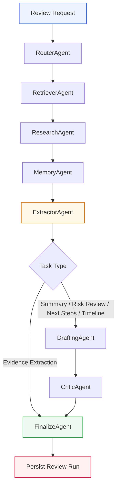
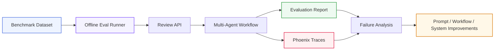

# Agentic Legal Review Backend

Industry-grade multi-agent backend for legal document review, evidence extraction, and AI-assisted workflow automation, built with FastAPI, LangGraph, PostgreSQL, Pinecone, Phoenix, and configurable LLM providers.

The system supports document ingestion, grounded retrieval, specialised multi-agent orchestration, persisted review runs, human approval and revision workflows, offline evaluation, and trace-based observability for operational reliability.

It also includes A2A protocol integration, enabling external agents and organisational systems to interact with the backend for review execution, workflow handoff, and interoperable agent-driven automation.

## System Architecture

Agent Workflow

Evaluation and Observability Loop

Overview
This backend is designed as a foundation for agentic AI applications in legal and document-heavy workflows.

It combines:

multi-agent orchestration with LangGraph
retrieval over ingested documents and Pinecone
A2A protocol integration for external agent interoperability
Postgres-backed run persistence and revision lineage
API-based human approval and revision workflows
Phoenix tracing for observability and debugging
offline evaluation for regression-style benchmarking
The focus is on building reliable, inspectable, and extensible AI systems that can move beyond lightweight demos into production-ready workflows.

Core Capabilities
Multi-agent review orchestration
Document ingestion and vector retrieval
Task routing across multiple review types
Fact extraction, drafting, critique, and finalization
External tool integration for supplementary context
Persistent review run storage in Postgres
Human approval and revision support
Offline evaluation harness for benchmark testing
Trace-based debugging and latency visibility
A2A protocol support for external agent and system integration
Supported Review Tasks
The backend supports:

document summarisation
legal / contractual risk review
evidence extraction
practical next-step recommendations
timeline generation
Request Lifecycle
A review request is submitted through the API.
The request is routed through a LangGraph-based multi-agent workflow.
Relevant evidence is retrieved from inline documents or Pinecone.
Optional external context is gathered through research tools.
Memory is loaded from persisted case context where available.
Facts are extracted from source evidence.
A draft answer is generated when appropriate.
The answer is critiqued and finalised.
The run is persisted in Postgres.
Human reviewers can approve or request revisions.
External agent and organisational workflows can interact through A2A-compatible integration paths.
Persistence Model
The backend persists review lifecycle data such as:

question
task type
status
extracted facts
draft answer
critique output
final answer
sources
external context
reviewer notes
revision lineage
This enables:

run history
auditability
human review
evaluation analysis
trace correlation
Tech Stack
Backend
Python
FastAPI
LangGraph
SQLModel
PostgreSQL
Retrieval and Storage
Pinecone
document chunking and embeddings
Postgres-backed review state
lightweight durable memory
LLM / AI
OpenAI
Ollama
Anthropic-compatible workflows
external tools
multi-agent orchestration
A2A protocol integration
Evaluation and Observability
Phoenix
offline evaluation runner
trace-based failure and latency analysis
structured debugging and review lineage
API Endpoints
Main endpoints include:

POST /api/v1/ingest/text
POST /api/v1/ingest/file
POST /api/v1/review
GET /api/v1/review-runs
GET /api/v1/review-runs/{run_id}
POST /api/v1/review-runs/{run_id}/approve
POST /api/v1/review-runs/{run_id}/revise
Running Locally
Install dependencies
uv sync
Configure environment
Set values in .env for:

OpenAI or Ollama
Pinecone
PostgreSQL
Phoenix
Start the backend
uv run uvicorn app.main:app --reload
Optional: start Phoenix
PHOENIX_GRPC_PORT=4318 phoenix serve
Optional: start Ollama
ollama serve
Why This Project
This project was built to explore what an industry-grade GenAI backend looks like beyond lightweight chatbot demos and notebook experiments.

The emphasis is on:

backend architecture
multi-agent orchestration
retrieval and evidence grounding
persistence and auditability
observability and debugging
offline evaluation
human-in-the-loop review
interoperable agent workflows through A2A integration
Current Limitations
uploaded documents are not yet stored in a dedicated Postgres documents table
OCR is not yet implemented for scanned / image-based PDFs
local eval models may return weaker or malformed structured outputs
large benchmark runs are constrained by cost / quota / runtime tradeoffs
auth and multi-user scoping are not yet implemented
Future Improvements
dedicated document persistence layer
OCR support
stronger online evaluation metrics
richer benchmark sets and scoring
auth and project / user scoping
asynchronous benchmark execution
deployment hardening
richer A2A interoperability patterns for cross-system workflow execution
