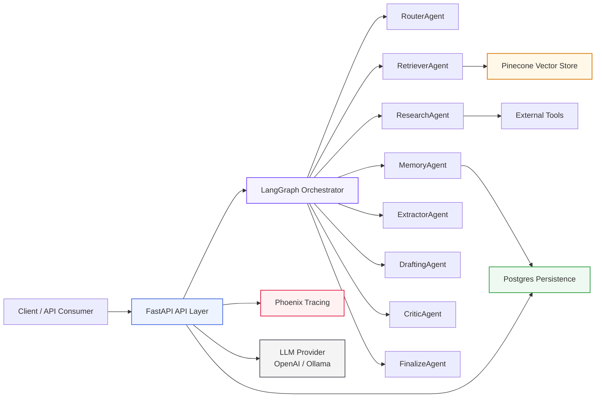
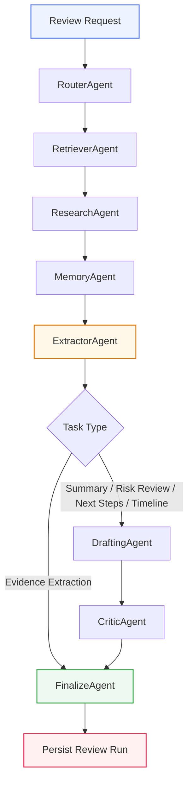
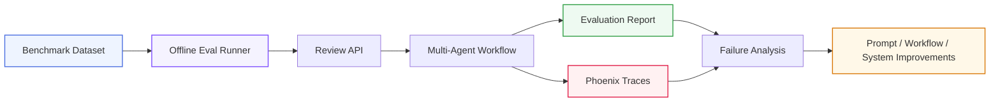

# Agentic Legal Review Backend

Industry-grade multi-agent backend for legal document review, evidence extraction, and AI-assisted workflow automation, built with FastAPI, LangGraph, PostgreSQL, Pinecone, Phoenix, and configurable LLM providers.

The system supports document ingestion, grounded retrieval, specialised multi-agent orchestration, persisted review runs, human approval and revision workflows, offline evaluation, and trace-based observability for operational reliability.

It also includes A2A protocol integration, enabling external agents and organisational systems to interact with the backend for review execution, workflow handoff, and interoperable agent-driven automation.

## System Architecture

Agent Workflow

Evaluation and Observability Loop

